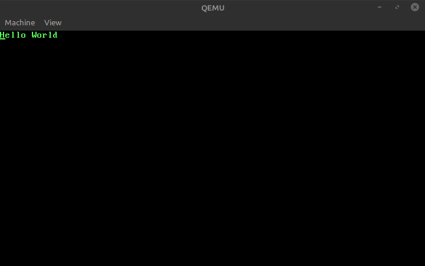

# boot-hello
A simple hello world Master Boot Record program



### How to build and run the "MBR code"
Programs needed:
- nasm
- qemu (i386)

Compile with:
```bash
make run
```

### The MBR program escalates to privilege mode with a GDT structure:
```as
; GDT Segment
gdt_start:
    ; Nullable structure
    dq 0
code_segment:
    ; Code segment structure data
    dw 0xFFFF
    dw 0x0
    db 0x0
    db 10011010b
    db 11001111b
    db 0x0
data_segment:
    ; Data segment structure data
    dw 0xFFFF
    dw 0x0
    db 0x0
    db 10010010b
    db 11001111b
    db 0x0
gdt_end:

```

> In privilege mode, the VGA buffer control is available to us, and we can't access any BIOS service routines

The write function operation acts directly on the VGA buffer:

```as
write:
    ; The instruction 'lodsb' prefer the string pointer at the register (ESI)
    mov esi, edi

    mov ebx, VGA_TEXT_BUFFER
    mov ch, VGA_TB_GREEN
.write_LOOP:
    lodsb
    cmp al, 0
    ; We have arrived to the 0 byte, going out :)
    je .write_done
    or ax, cx
    mov word [ebx], ax
    add ebx, 2
    jmp .write_LOOP
.write_done:
    ret
```
